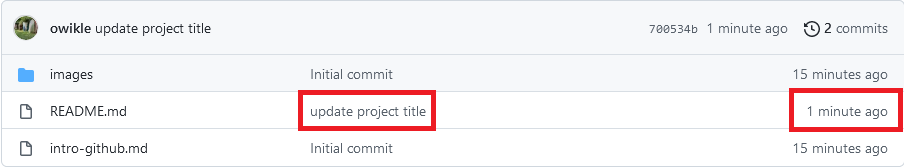

# Deploying CollectionBuilder on GitHub

## Set up and Explore GitHub

Before we get started, let's clarify some terms:

[Git](https://git-scm.com/) is a popular free, distributed version control system–i.e. a piece of software used to track the history of changes in a folder of files. Git can be used on your personal computer, or by online services to track the development of a project, such as…

[GitHub](https://github.com/), a popular web platform for hosting Git repositories–i.e. a place to store and sync your project files online. Think of it as Google Drive for code with super robust "track changes" baked in. Built around the powerful version control of Git, it provides a handy web interface for managing, editing, and collaborating on repositories.

Also before we get started, if you don't have a Google account, [please create one here](https://support.google.com/accounts/answer/27441?hl=en).

### Step 1. Create a GitHub account

1. Go to <https://github.com>
2. Click the "Sign up" button
3. Enter your email and create a username and password to complete the sign up process
4. Be sure to "skip personalization" and choose a free account

### Step 2. Copy the CollectionBuilder Template (GitHub Repository)

Copy code from the CollectionBuilder-GH repository into your own and start editing it. This code forms the template from which you will build your project during this workshop.

1. Make sure you're logged into your account on [GitHub](https://github.com)
2. Navigate to the [collectionbuilder-gh](https://github.com/CollectionBuilder/collectionbuilder-gh) GitHub repository and click the green "Use This Template" button (appears on the right side above the code area)
4. This brings you to a "Create a new repository" form. Follow these steps:
    1. In the **Repository name** text box, give your repository the name `yokai-senjafuda`. If you'd like to create your own name for the repository, be sure to use a lowercase name without spaces or odd characters. Dashes (`-`) or underscores (`_`) are okay.
    2. In the **Description** text box, add `A demo CollectionBuilder site`.
    3. Select the option for "**Public**" repository.
    4. Leave the "Include all branches" option **Unchecked**!
    5. Click on the green button "**Create repository from template**". This will take you to your new repository.

### Step 3. Edit README file

Explore your new repository. Note in particular these files and folders:
- README.md - notice it has links to instructions for using this template
- _config.yml - this controls elements of the site at a high level
- _data folder - contains the metadata spreadsheet that will control content on the site
- objects folder - contains images that build the website and a readme.md file with instructions on adding images to your project
- pages folder - contains markdown pages that will create the website

1. Click on the `README.md` link. This will open your README file.


The README file is a place to describe your repository.
By default, GitHub displays the README on the repository home page, so it is often the first place visitors will look for information about your project.

2. In the top right corner of the README file, locate and click on the pencil icon.

You are now in GitHub's editing mode.

The first line at the top of the file will look like this:

```
# collectionbuilder-gh

```

3. Delete this line of text and instead type `# My Project`.
4. Proceed to the following section to learn how to save or "commit" your changes.

### Step 4. Make a Commit

When you make a commit, Git takes a snapshot of the changes you made and permanently stores it in your repository's history.
Your "commit message" is a short description of what the changes do or why you made them--this is your note to the future to help everyone understand the code and history.

1. To commit the changes you just made to your README file, scroll to the bottom of the page where you made your README edits. You'll see a box titled "Commit changes."
2. In the text box directly underneath "Commit changes," type `update project title`, or a brief message of your choosing that indicates what changes you made to this file.
3. Skip the option to add an extended description to the commit, and keep the box checked next to "Commit directly to the main branch".
4. Click on the green "Commit changes" button. This will take you back to your repository's homepage.
5. Scroll down to the bottom of your repository to view the new title you added to the README file.

You can view recent commits on your repository's homepage.
Commit messages and their timestamps are located to the right of the repository files:



### Step 5. View the Changes

Let's take a closer look at the changes you've made to the README file:

1. On your repository's homepage, locate the README.md file link. To the right of the link, you should see the commit message you just created (it should say `update project title`).
2. Click on the commit message.

You should now see two versions of your README file, displayed side by side.
You are viewing the difference between the original version of your repository's README file (on the left), and the new version that you created by editing it (on the right). 


3. Click your repository's name (located in the top left of the window) to return to the repository's home page.

### Step 6. Check Out the Repository's History

Let's view all the changes we've made to the repository so far.

1. On your repository's home page, locate the commit count for your repository, situated underneath the green "Code" button and to the right of the clock icon. It should display a number followed by the word "commits" (example: "2 commits"): 
2. Click on this commit count link.

You are now viewing your repository's history (all the commits that have ever been made to your repository).

3. Click on the commit message `update project title` to view the changes that were made as part of that commit.
4. Click your repository's name (located in the top left of the window) to return to the repository's home page.

### Step 7. Turn on GitHub Pages (Make this demo project a website!)

Now it's time to turn on the webpage associated with this project. This website is the digital project we will develop and update over the course of the workshop.

1. On your repository's home page, locate and click the "Settings" link, which is the very top right menu item on the menu. 
2. Scroll down on the vertical "Settings" Menu and select "Pages" (the last link in the "Code and Automation" section).
3. Under "Source," select the button that says "None", and choose "main" from the dropdown.
4. Click the "Save" button to the right of the Source button, which now should read "branch: main."
5. You should now see a notification saying "Your site is ready to be published at https://[YourUsername].github.io/yokai-senjafuda/" Select the link listed here and copy it.
6. Navigate back to the homepage of your repository by clicking on the leftmost menu item in the top left of your screen, "<> Code." (Alternatively, click on the name of your repository, "yokai-senjafuda.")
7. Click on the Settings gear icon located in the "About" box located to the right of the green "Code" button to bring up the "Edit repository details" screen. 
8. Paste your website url into the "Website" box, and click the green "Save Changes" button.

### Step 8. Explore the relationship between your repository and the website

1. Open the link to the website in the "About" section of your repository in a new window or tab and explore the website. Note that it may take as little as 30 seconds or as much as 15 minutes for your website to deploy. Before it has deployed, you will see a 404 error message when you click the link.
2. Returning to your repository, click into the objects folder: note the images, which correspond to the images on the website, and the readme.md file with instructions on adding images to your project.
3. Click into the pages folder: note that the names of the markdown pages here correspond to the names of the main page on the website.
4. Note that these markdown pages are not the final pages served by Jekyll. Rather, they instruct Jekyll on how to create the final html pages served by GitHub pages. You can see that final html by navigating to the website. Right click “view page source” to see the html that creates these web pages. 

## Configure your Demo Project

### Step 9. Import our sample project images. 

1. You can download the sample materials for our project using [this link](https://downgit.github.io/#/home?url=https://github.com/learn-static/collectionbuilder-workshop/tree/main/student_materials) generated via [DownGit](https://downgit.github.io/#/home). (If you are curious, the sample materials are in the **student_resources** folder of [this GitHub repository](https://github.com/learn-static/collectionbuilder-workshop). We use DownGit so you don't have to download the entire repository to access just these files.)  |
2. Upload the images you just downloaded to the images folder.
3. Upload the senjafuda-metadata.csv file to the data folder.

### Step 10. Configure your website

1. Navigate to the `_config.yml` and select the "pencil" button to go to editing mode.
2. Notice that this controls the configuration of the entire website.
3. Change the settings to something similiar to what you see here, and put your name where it says "Your Name":

```
##########
# SITE SETTINGS
#
# title of site appears in banner
title: Yōkai Senjafuda
# tagline, a short phrase that will appear throughout the site in the top banner
tagline: Depictions of Japanese Ghosts and Monsters
# description appears in meta tags and other locations
# this description might appear in search result lists, keep around 160 characters max
description: "A digital exhibit made using CollectionBuilder"
# creator of the digital collection, to appear in meta tags; we typically use our GitHub usernames but feel free to just use your name
author: Your Name

##########
# COLLECTION SETTINGS
#
# Set the metadata for your collection (the name of the csv file in your _data directory that describes the objects in your collection) 
# Use the filename of your CSV **without** the ".csv" extension! E.g. _data/demo-metadata.csv --> "demo-metadata"
metadata: senjafuda-metadata
```

### Step 10. Explore the website

1. Note that it may take as little as 30 seconds or as much as 15 minutes for your website to deploy. Before it has deployed, there will be a small yellow circle below and to the left of the green **Code** button in your repository. If an error occurs, a red **X** will appear. When the website has successfully deployed, you will see a green check mark.
3. Check the website, discover there are only 8 images appearing, and that there are text encoding errors for the macron (diacritical mark over the o) in several romanized Japanese words. UTF-8, the encoding Google Sheets uses for saving our CSVs, includes encoding for macrons. However, as this material was cut and pasted, the encoding was lost somewhere along the way.

### Step 11. Fix the errors in your metadata. 

1. Navigate to [Google Sheets](https://docs.google.com/spreadsheets/u/0/), and create a new spreadsheet. For some basics on using spreadsheets, see  [this introduction](https://thecdil.github.io/hist-454-2022/spreadsheets.html).
2. In a new tab, navigate to the [student materials folder in this repository](https://raw.githubusercontent.com/learn-static/collectionbuilder-workshop/main/student_materials), and select the `senjafuda-metadata.csv`. Then select the "Raw" button in the top right hand corner to open just the contents of the csv. 
3. Now select and copy the url associated with this metadata (https://raw.githubusercontent.com/learn-static/collectionbuilder-workshop/main/student_materials/senjafuda-metadata.csv).
4. Now toggle back to your Google Sheets, and in cell A1, enter =IMPORTDATA("https://raw.githubusercontent.com/learn-static/collectionbuilder-workshop/main/student_materials/senjafuda-metadata.csv"). Instead of typing out the url, you can paste in between two quotes the web link you just copied. 
5. Now correct the errors you found in the website. Here are [instructions to type a macron for Mac](https://support.apple.com/guide/mac-help/enter-characters-with-accent-marks-on-mac-mh27474/mac) and [instructions to type a macron for Windows](https://support.microsoft.com/en-us/office/keyboard-shortcuts-to-add-language-accent-marks-in-word-3801b103-6a8d-42a5-b8ba-fdc3774cfc76)
6. Download the new Google sheets csv. Rename it senjafuta-metadata.csv.
7. Re-upload, commit and confirm fix.  


